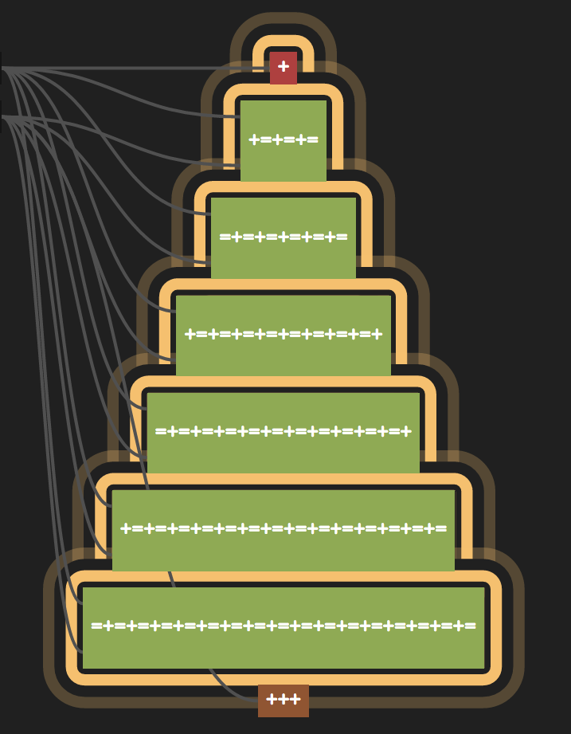

# x-mas-tree
A little holiday cheer with concourse.ci



Steps to install:

1. [Deploy Concourse](http://concourse.ci/getting-started.html) (skip this step if you already have Concourse installed):
  ```bash
  vagrant init concourse/lite
  vagrant up
  ```
2. Create a new pipeline:
  ```bash
  fly set-pipeline -p x-mas-tree -c x-mas-tree.yml
  fly unpause-pipeline -p x-mas-tree
  ```
3. To make the trunk brown, click on it then click on the X to cancel its build.
